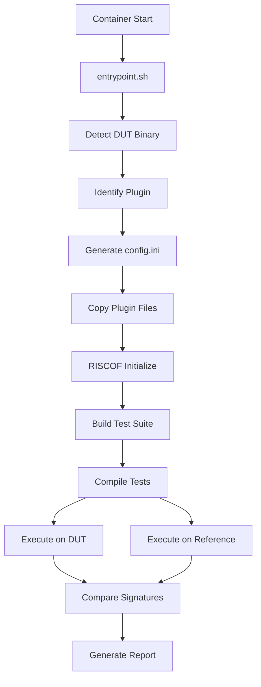

# System Architecture

## Overview

The ZKEVM Test Monitor follows a modular, plugin-based architecture built around the RISCOF (RISC-V Architectural Test Framework). The system is designed for differential testing where each ZKVM implementation is tested against a reference model.

## Architecture Diagram

```
┌─────────────────────────────────────────────────────────────┐
│                    Docker Container                         │
├─────────────────────────────────────────────────────────────┤
│  ┌─────────────────┐  ┌─────────────────┐  ┌──────────────┐ │
│  │   Test Suite    │  │   RISCOF Core   │  │  Reference   │ │
│  │  (Arch Tests)   │  │   Framework     │  │    Model     │ │
│  └─────────────────┘  └─────────────────┘  │ (Sail RISC-V)│ │
│           │                     │          └──────────────┘ │
│           └─────────┬───────────┘                 │         │
│                     │                             │         │
│  ┌─────────────────────────────────────────────────────────┐ │
│  │              Plugin Interface Layer                     │ │
│  └─────────────────────────────────────────────────────────┘ │
│           │         │         │         │         │         │
│  ┌──────────┐ ┌──────────┐ ┌──────────┐ ┌──────────┐ ┌──────┐ │
│  │    SP1   │ │   Jolt   │ │ OpenVM   │ │  Spike   │ │ ... │ │
│  │  Plugin  │ │  Plugin  │ │  Plugin  │ │  Plugin  │ │     │ │
│  └──────────┘ └──────────┘ └──────────┘ └──────────┘ └──────┘ │
│       │            │            │            │                │
│  ┌──────────┐ ┌──────────┐ ┌──────────┐ ┌──────────┐         │
│  │   SP1    │ │   Jolt   │ │  OpenVM  │ │  Spike   │         │
│  │ Emulator │ │ Emulator │ │ Emulator │ │ Emulator │         │
│  └──────────┘ └──────────┘ └──────────┘ └──────────┘         │
└─────────────────────────────────────────────────────────────┘
           │            │            │            │
    ┌─────────────────────────────────────────────────────────┐
    │                Volume Mounts                            │
    │  - ZKVM Binaries (/dut/bin)                            │
    │  - Plugin Config (/dut/plugin)                         │
    │  - Test Results (/riscof/riscof_work)                  │
    └─────────────────────────────────────────────────────────┘
```

## Core Components

### 1. RISCOF Framework
- **Location**: `/riscof/` (in container)
- **Purpose**: Orchestrates test execution and comparison
- **Responsibilities**:
  - Test discovery and compilation
  - Parallel test execution
  - Signature comparison between DUT and reference
  - Report generation

### 2. Plugin System
- **Location**: `plugins/` directory
- **Base Class**: `pluginTemplate` from RISCOF
- **Interface**: Standardized methods for build, run, and test execution

#### Plugin Structure
```
plugins/
├── <zkvm_name>/
│   ├── riscof_<zkvm_name>.py    # Main plugin implementation
│   ├── <zkvm_name>_isa.yaml     # ISA specification
│   ├── <zkvm_name>_platform.yaml # Platform specification
│   └── env/                     # Environment files
│       └── link.ld              # Linker script
```

### 3. Dynamic Configuration System
- **Entry Point**: `entrypoint.sh`
- **Purpose**: Auto-detect and configure test environment
- **Process**:
  1. Detect mounted ZKVM binary
  2. Identify plugin type from directory structure
  3. Generate RISCOF configuration file
  4. Set up PATH and environment variables
  5. Execute tests

### 4. Test Execution Flow



## Plugin Architecture Details

### Base Plugin Interface
All plugins inherit from `pluginTemplate` and implement:

```python
class ZKVMPlugin(pluginTemplate):
    def __init__(self, config): pass
    def initialise(self, suite, work_dir, archtest_env): pass
    def build(self, isa_yaml, platform_yaml): pass
    def runTests(self, testList): pass
```

### Configuration Management
- **ISA YAML**: Defines supported RISC-V extensions and capabilities
- **Platform YAML**: Specifies platform-specific configurations
- **Environment**: Linker scripts and compilation settings

### Test Compilation Process
1. **Cross-Compilation**: Uses `riscv*-unknown-elf-gcc` toolchain
2. **Target Generation**: Creates ELF binaries for each test
3. **Macro Substitution**: Applies test-specific compile macros
4. **Parallel Build**: Utilizes make with job parallelization

### Signature Extraction
- **Purpose**: Extract memory regions containing test checkpoints
- **Format**: Memory dumps written during test execution
- **Comparison**: Differential analysis between DUT and reference signatures

## Volume Mount Strategy

### Input Mounts
- `/dut/bin`: ZKVM executable directory
- `/dut/plugin`: Plugin configuration directory

### Output Mounts
- `/riscof/riscof_work`: Test results and artifacts

### Internal Paths
- `/riscof/toolchains/`: RISC-V cross-compilation toolchain
- `/riscof/emulators/`: Reference model binaries
- `/riscof/riscv-arch-test/`: Official test suite

## Scalability Features

### Parallel Execution
- **Test Level**: Multiple tests run simultaneously
- **Job Control**: Configurable via `jobs` parameter
- **Resource Management**: Optimized for container resource limits

### Modular Design
- **Plugin Isolation**: Each ZKVM plugin is independent
- **Extensibility**: New ZKVMs can be added without core changes
- **Configuration Flexibility**: Per-plugin ISA and platform settings

## Security Considerations

### Container Isolation
- **Read-Only**: Test suite and framework files
- **Controlled Writes**: Only to designated result directories
- **Network Isolation**: No external network access required

### Binary Safety
- **Mounted Binaries**: External ZKVM binaries are isolated
- **Execution Sandboxing**: Tests run in controlled environment
- **Resource Limits**: Container resource constraints prevent abuse