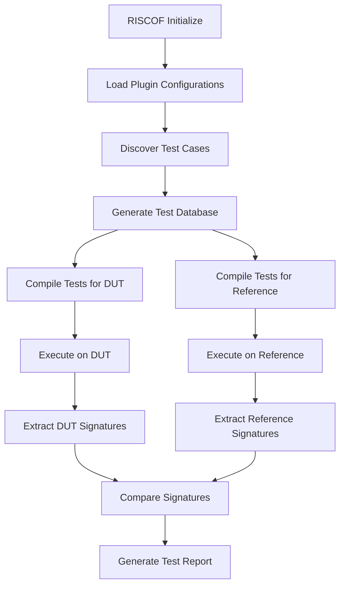

# RISCOF Testing Framework Integration

## Overview

RISCOF (RISC-V Architectural Test Framework) is the core testing engine that orchestrates differential testing between ZKVM implementations and reference models. This document details how RISCOF is integrated and configured within the ZKEVM Test Monitor.

## RISCOF Architecture

### Framework Components
1. **Test Suite Management**: Official RISC-V architectural tests
2. **Plugin System**: Modular DUT (Device Under Test) integration
3. **Reference Model**: Sail RISC-V formal specification
4. **Signature Comparison**: Differential analysis engine
5. **Report Generation**: HTML-based result reporting

### Test Execution Flow


## Configuration System

### Dynamic Configuration (`entrypoint.sh`)
The container automatically generates RISCOF configuration based on mounted plugins:

```ini
[RISCOF]
ReferencePlugin=sail_cSim
ReferencePluginPath=plugins/sail_cSim
DUTPlugin=<detected_plugin>
DUTPluginPath=plugins/<detected_plugin>

[<detected_plugin>]
pluginpath=plugins/<detected_plugin>
ispec=plugins/<detected_plugin>/<plugin>_isa.yaml
pspec=plugins/<detected_plugin>/<plugin>_platform.yaml
target_run=1
PATH=/riscof/dut-bin/
jobs=48
```

### ISA Specification (YAML)
Defines the RISC-V implementation characteristics:
```yaml
hart_ids: [0]
hart0:
  ISA: RV32IM                    # Supported extensions
  physical_addr_sz: 32           # Address space size
  User_Spec_Version: '2.3'       # RISC-V spec version
  supported_xlen: [32]           # Register width
  misa:                          # Machine ISA register
    rv32:
      accessible: true
      mxl:                       # MXL field configuration
        implemented: true
        type:
          warl:                  # Write Any Read Legal
            legal: [0x1]         # Legal values
```

### Platform Specification (YAML)
Describes platform-specific configurations:
- Memory layout and regions
- Device tree configurations
- Platform-specific registers
- I/O address mappings

## Test Suite Integration

### RISC-V Architectural Tests
- **Version**: 3.9.1 (latest stable)
- **Location**: `/riscof/riscv-arch-test/`
- **Structure**: Organized by ISA extensions and test categories

#### Test Categories
```
riscv-test-suite/
├── rv32i/              # Base integer instruction tests
├── rv32im/             # Integer + multiplication tests
├── rv32imc/            # Compressed instruction tests
├── rv64i/              # 64-bit base integer tests
└── env/                # Test environment files
```

### Test Environment
- **Compilation Environment**: `/riscv-arch-test/riscv-test-suite/env`
- **Macros**: Test-specific preprocessor definitions
- **Linker Scripts**: Memory layout specifications
- **Assembly Includes**: Common test infrastructure

## Plugin Integration

### Plugin Discovery Process
1. **Binary Detection**: Locate executable in `/dut/bin`
2. **Plugin Identification**: Find `riscof_*.py` in `/dut/plugin`
3. **Configuration Setup**: Copy plugin files to framework directory
4. **Python Package**: Create proper `__init__.py` structure

### Plugin Interface Requirements
All plugins must implement the RISCOF `pluginTemplate`:

```python
class ZKVMPlugin(pluginTemplate):
    def __init__(self, config):
        # Initialize plugin with configuration
        pass
    
    def initialise(self, suite, work_dir, archtest_env):
        # Set up compilation and execution environment
        pass
    
    def build(self, isa_yaml, platform_yaml):
        # Configure for specific ISA/platform
        pass
    
    def runTests(self, testList):
        # Execute test suite
        pass
```

## Compilation Process

### Cross-Compilation Setup
- **Toolchain**: riscv32-unknown-elf-gcc
- **Target**: RISC-V 32-bit embedded
- **Flags**: `-static -mcmodel=medany -fvisibility=hidden -nostdlib -nostartfiles`

### Test Compilation Steps
1. **Macro Processing**: Apply test-specific `-D` definitions
2. **Include Paths**: Plugin environment and test environment
3. **Linker Script**: Custom `link.ld` from plugin
4. **Output**: ELF binary for each test case

### Example Compilation Command
```bash
riscv32-unknown-elf-gcc -march=rv32im \
  -static -mcmodel=medany -fvisibility=hidden -nostdlib -nostartfiles -g \
  -T /plugin/env/link.ld \
  -I /plugin/env/ \
  -I /riscv-arch-test/riscv-test-suite/env \
  -D RVTEST_MEMORY_BASE=0x80000000 \
  -o test.elf test.S
```

## Signature Extraction

### Signature Concept
Signatures are memory checkpoints written during test execution that capture the state of computation at specific points.

### Signature Format
- **Location**: Specific memory region defined by test
- **Content**: Memory dumps containing intermediate results
- **Comparison**: Byte-wise comparison between DUT and reference

### Extraction Process
1. **Memory Region**: Tests write to designated signature memory area
2. **Dump Mechanism**: Each implementation extracts this region
3. **File Output**: Written to `<plugin_name>.signature`
4. **Verification**: RISCOF compares DUT vs reference signatures

## Test Execution

### Parallel Execution
- **Framework**: GNU Make with job parallelization
- **Concurrency**: Configurable via `jobs` parameter (default: 48)
- **Resource Management**: Optimized for container environments

### Execution Command Template
```bash
riscof run \
  --config=/riscof/config.ini \
  --suite=/riscof/riscv-arch-test/riscv-test-suite/ \
  --env=/riscof/riscv-arch-test/riscv-test-suite/env \
  --no-clean
```

### Error Handling
- **Graceful Degradation**: Individual test failures don't stop execution
- **Logging**: Comprehensive output capture
- **Status Tracking**: Pass/fail status for each test

## Reference Model Integration

### Sail RISC-V Model
- **Type**: Formal specification-based simulator
- **Purpose**: Golden reference for ISA compliance
- **Version**: 0.7 (latest stable)
- **Location**: `/riscof/emulators/sail-riscv/`

### Reference Plugin (`sail_cSim`)
- **Implementation**: Pre-built reference plugin
- **Configuration**: Standard RISC-V configuration
- **Signature Format**: Canonical signature extraction

## Report Generation

### HTML Report
- **File**: `report.html` in results directory
- **Content**: Test pass/fail summary, detailed results
- **Format**: Interactive HTML with test case details

### Report Structure
```
results/
├── report.html         # Main test report
├── <test_name>/        # Individual test directories
│   ├── test.elf       # Compiled test binary
│   ├── dut.signature  # DUT signature file
│   ├── ref.signature  # Reference signature file
│   └── test.log       # Execution log
```

### Analysis Features
- **Pass/Fail Summary**: Overall test suite results
- **Failure Analysis**: Detailed diff for failed tests
- **Coverage Metrics**: ISA extension coverage
- **Performance Data**: Execution timing (if available)

## Performance Optimization

### Compilation Optimization
- **Parallel Make**: Multiple tests compiled simultaneously
- **Caching**: Intermediate compilation artifacts
- **Resource Limits**: Configurable job limits

### Execution Optimization
- **Batch Processing**: Tests grouped for efficient execution
- **Resource Management**: CPU and memory usage optimization
- **I/O Efficiency**: Minimized file system operations

## Debugging and Troubleshooting

### Common Issues
1. **Compilation Failures**: ISA compatibility, toolchain issues
2. **Execution Errors**: Binary compatibility, runtime errors
3. **Signature Mismatches**: Implementation differences, timing issues

### Debug Information
- **Verbose Logging**: Detailed execution traces
- **Test Artifacts**: All intermediate files preserved
- **Error Context**: Specific failure information in reports

### Debug Mode
```bash
# Run with detailed logging
riscof run --config=config.ini --suite=test-suite/ --verbose
```

## Advanced Configuration

### Custom Test Suites
- **Path Configuration**: Support for custom test directories
- **Filter Options**: Run specific test subsets
- **Extension Testing**: Focus on particular ISA extensions

### Performance Tuning
- **Job Parallelization**: Optimize for available CPU cores
- **Memory Usage**: Configure for container resource limits
- **I/O Performance**: Optimize file system operations

### Integration Options
- **CI/CD Integration**: Automated testing pipelines
- **Custom Reporting**: Alternative report formats
- **Metric Collection**: Performance and coverage data