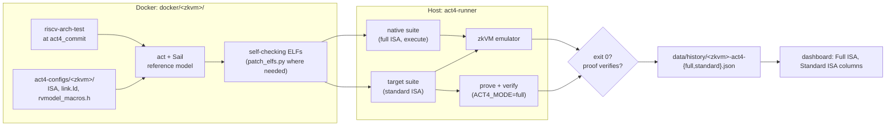
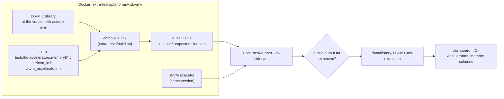

# zkevm-test-monitor

Compliance testing for zkVMs with two test suites:

- **ACT4:** RISC-V ISA compliance, with the [ACT4](https://github.com/riscv-non-isa/riscv-arch-test/tree/act4) framework.
- **act-extra:** the EIP-8025 guest interfaces (I/O, cryptographic accelerators, memory operations), with small C programs in [`extra-tests/`](extra-tests/README.md).

**Dashboard:** https://eth-act.github.io/zkevm-test-monitor/

## Test pipelines

Both pipelines build test ELFs in Docker and run them on the host with `act4-runner`. They differ
in where the tests come from, what they link against, and how a test passes. (ACT4 zkVMs without
a split pipeline in `src/test.sh` still run their tests inside Docker.)

### ACT4 (ISA compliance)



- The Sail reference model runs at compile time and embeds the expected values, so each ELF
  checks itself. It exits 0 on pass and non-zero on fail.
- In `ACT4_MODE=prove` or `full`, a target test must also prove, and in `full` also verify.
- `./run test <zkvm>` runs this pipeline. `FORCE=1` regenerates the ELFs.

### act-extra (EIP-8025 guest interfaces)



- Each test is a small C program that uses only the standard headers. It links against the
  zkVM's own static library, the way an EIP-8025 guest does.
- The runner gives each program its `.input` file and compares its public output with its
  `.expected` file (default: `PASS`). A self-checking program writes `FAIL` and a check id on
  failure.
- The zkVM exit code is not used, because not every zkVM reports the guest's exit code.
- The suite runs execution only, for ZisK, SP1 and OpenVM. Each act-extra image pins its own zkVM
  version, independent of `config.json`. See [`extra-tests/README.md`](extra-tests/README.md).
- `./run extra <zkvm>` runs only this pipeline. `./run test <zkvm>` runs it after ACT4 for these
  three zkVMs (`EXTRA=0` skips it).

## Supported ZK-VMs

| ZK-VM | ISA | Repo |
|-------|-----|------|
| SP1 | RV64IM | [succinctlabs/sp1](https://github.com/succinctlabs/sp1) |
| OpenVM | RV32IM | [openvm-org/openvm](https://github.com/openvm-org/openvm) |
| Zisk | RV64IMFDAC | [0xPolygonHermez/zisk](https://github.com/0xPolygonHermez/zisk) |

## Usage

```bash
./run build sp1          # Build binary via Docker
./run test sp1           # Run ACT4 tests
./run test sp1 zisk      # Test multiple
./run test               # Test all
./run extra sp1          # Run only the act-extra suite (zisk, sp1, openvm)
./run all sp1            # Build + test
./run serve              # Dashboard at localhost:8000
./run clean              # Remove artifacts
```

### Environment variables

```bash
JOBS=8 ./run test zisk              # Limit CPU cores
ACT4_JOBS=N ./run test zisk         # Override parallel jobs inside container
FORCE=1 ./run test zisk             # Regenerate ELFs from scratch
ACT4_MODE=execute ./run test zisk   # Execution only (no proving); also: prove, full (default)
EXTRA=0 ./run test zisk             # Skip the act-extra suite
GPU=1 ./run build zisk              # Build with GPU support
GPU=1 ./run test zisk               # Prove with GPU
```

## Adding a ZK-VM

1. Add entry to `config.json`
2. Create `docker/build-<name>/Dockerfile`
3. Create `docker/<name>/Dockerfile` + `entrypoint.sh`
4. Create `act4-configs/<name>/<isa>/` with `test_config.yaml`, `sail.json`, `link.ld`, `rvmodel_macros.h`

## Project layout

```
run                     Entry point
config.json             ZK-VM repo URLs and commit pins
src/                    Build and test scripts
docker/<zkvm>/          Per-ZK-VM ACT4 test Docker setup
docker/build-<zkvm>/    Per-ZK-VM binary build Dockerfiles
docker/shared/          Shared utilities (patch_elfs.py)
act4-configs/           Per-ZK-VM ACT4 ISA/platform configs
act4-runner/            Host-side test runner (Rust) for both suites
extra-tests/            act-extra: C guests, headers, per-zkVM platforms
docs/                   Dashboard (generated)
data/history/           Historical pass/fail tracking
scripts/                Utility scripts
notes/                  Reference documents and notes
```

## Requirements

- Docker
- Bash

## License

Dual-licensed under [Apache 2.0](LICENSE-APACHE) or [MIT](LICENSE-MIT).
