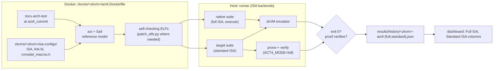
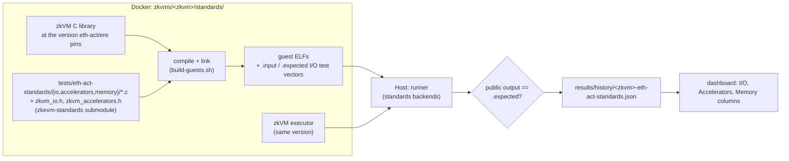

# zkevm-test-monitor

Compliance testing for zkVMs with two test suites:

- **ISA tests:** RISC-V ISA compliance, with the [ACT4](https://github.com/riscv/riscv-arch-test) framework (release [4.1.0](https://github.com/riscv/riscv-arch-test/releases/tag/4.1.0)).
- **eth-act standards tests:** the [eth-act zkEVM standards](https://github.com/eth-act/zkevm-standards) for guest interfaces (I/O, cryptographic accelerators, memory operations), which EIP-8025 readiness uses, with small C programs in [`tests/eth-act-standards/`](tests/eth-act-standards/README.md).

**Dashboard:** https://eth-act.github.io/zkevm-test-monitor/

## Test pipelines

Both pipelines build test ELFs in Docker and run them on the host with one Rust runner
([`src/runner/`](src/runner/)), through a backend per zkVM and suite. They differ
in where the tests come from, what they link against, and how a test passes. (ACT4 zkVMs without
a split pipeline in `src/run-isa-tests.sh` still run their tests inside Docker.)

### ISA tests (ACT4)


```mermaid
flowchart LR
    subgraph docker["Docker: zkvms/&lt;zkvm&gt;/act4.Dockerfile"]
        tests["riscv-arch-test<br/>at act4_commit"] --> act["act + Sail<br/>reference model"]
        cfg["zkvms/&lt;zkvm&gt;/isa-configs/<br/>ISA, link.ld, rvmodel_macros.h"] --> act
        act --> elfs["self-checking ELFs<br/>(patch_elfs.py where needed)"]
    end
    elfs --> native["native suite<br/>(full ISA, execute)"]
    elfs --> target["target suite<br/>(standard ISA)"]
    subgraph host["Host: runner (ISA backends)"]
        native --> emu["zkVM emulator"]
        target --> emu
        target --> prove["prove + verify<br/>(ACT4_MODE=full)"]
    end
    emu --> verdict{"exit 0?<br/>proof verifies?"}
    prove --> verdict
    verdict --> hist["results/history/&lt;zkvm&gt;-act4-{full,standard}.json"]
    hist --> dash["dashboard: Full ISA, Standard ISA columns"]
```

- The Sail reference model runs at compile time and embeds the expected values, so each ELF
  checks itself. It exits 0 on pass and non-zero on fail.
- In `ACT4_MODE=prove` or `full`, a target test must also prove, and in `full` also verify.
- `./run isa-tests <zkvm>` runs this pipeline. `FORCE=1` regenerates the ELFs.

### eth-act standards tests (guest interfaces)


```mermaid
flowchart LR
    subgraph docker["Docker: zkvms/&lt;zkvm&gt;/standards/"]
        vendor["zkVM C library<br/>at the version eth-act/ere pins"] --> link["compile + link<br/>(build-guests.sh)"]
        src["tests/eth-act-standards/{io,accelerators,memory}/*.c<br/>+ zkvm_io.h, zkvm_accelerators.h<br/>(zkevm-standards submodule)"] --> link
        link --> elfs["guest ELFs<br/>+ .input / .expected I/O test vectors"]
        exe["zkVM executor<br/>(same version)"]
    end
    elfs --> runner["Host: runner<br/>(standards backends)"]
    exe --> runner
    runner --> verdict{"public output ==<br/>.expected?"}
    verdict --> hist["results/history/&lt;zkvm&gt;-eth-act-standards.json"]
    hist --> dash["dashboard: I/O, Accelerators, Memory columns"]
```

- Each test is a small C program that uses only the standard headers. It links against the
  zkVM's own static library, the way an EIP-8025 guest does.
- The runner gives each program its `.input` file and compares its public output with its
  `.expected` file (default: `PASS`). A self-checking program writes `FAIL` and a check id on
  failure. A program with the `.outcome` `fail` must panic instead (the NULL-pointer tests).
- The zkVM exit code is not used, because not every zkVM reports the guest's exit code.
- The suite runs execution only, for ZisK, SP1 and OpenVM. Each standards test image pins its own
  zkVM version, independent of `config.json`. See
  [`tests/eth-act-standards/README.md`](tests/eth-act-standards/README.md).
- `./run eth-act-standards-tests <zkvm>` runs this pipeline. `./run tests <zkvm>` runs both
  pipelines.

## Supported ZK-VMs

| ZK-VM | ISA | Repo |
|-------|-----|------|
| SP1 | RV64IM | [succinctlabs/sp1](https://github.com/succinctlabs/sp1) |
| OpenVM | RV32IM | [openvm-org/openvm](https://github.com/openvm-org/openvm) |
| Zisk | RV64IMFDAC | [0xPolygonHermez/zisk](https://github.com/0xPolygonHermez/zisk) |

## Usage

```bash
./run build sp1          # Build binary via Docker
./run isa-tests sp1                  # Run the ISA tests
./run eth-act-standards-tests sp1    # Run the eth-act standards tests (zisk, sp1, openvm)
./run tests sp1 openvm               # Run both suites for two zkVMs
./run tests                          # Run both suites for all zkVMs
./run all sp1                        # Build + both suites
./run serve              # Dashboard at localhost:8000
./run clean              # Remove artifacts
```

### Environment variables

```bash
JOBS=8 ./run tests zisk                 # Limit CPU cores
ACT4_JOBS=N ./run isa-tests zisk        # Override parallel jobs inside container
FORCE=1 ./run isa-tests zisk            # Regenerate ISA test ELFs from scratch
ACT4_MODE=execute ./run isa-tests zisk  # Execution only (no proving); also: prove, full (default)
GPU=1 ./run build zisk              # Build with GPU support
GPU=1 ./run isa-tests zisk              # Prove with GPU
```

## Adding a ZK-VM

1. Add entry to `config.json`
2. Create `zkvms/<name>/build.Dockerfile`
3. Create `zkvms/<name>/act4.Dockerfile` + `entrypoint.sh`
4. Create `zkvms/<name>/isa-configs/<isa>/` with `test_config.yaml`, `sail.json`, `link.ld`, `rvmodel_macros.h`
5. Optional: `zkvms/<name>/standards/` for the eth-act standards tests (see
   [`tests/eth-act-standards/README.md`](tests/eth-act-standards/README.md))

## Project layout

```
run                       Entry point
config.json               ZK-VM repo URLs and commit pins (zkVMs, ACT4, zkevm-standards)
src/                      Build and test scripts
src/runner/               Host-side test runner (Rust) for both suites
src/shared/               Shared utilities (patch_elfs.py)
zkvms/<zkvm>/             Everything specific to one ZK-VM:
  build.Dockerfile          binary build
  act4.Dockerfile           ACT4 image (+ entrypoint.sh)
  isa-configs/<isa>/        ACT4 ISA/platform configs
  standards/                eth-act standards platform: C library, executor, link.ld
tests/eth-act-standards/  eth-act standards tests: C guests, headers, vector tools
site/                     Dashboard (GitHub Pages)
results/history/          Historical pass/fail tracking (read by the dashboard)
out/                      Local outputs, not tracked: bin/, <zkvm>/ ELFs and logs,
                          commits/, deps/
```

## Requirements

- Docker
- Bash

## License

Dual-licensed under [Apache 2.0](LICENSE-APACHE) or [MIT](LICENSE-MIT).
