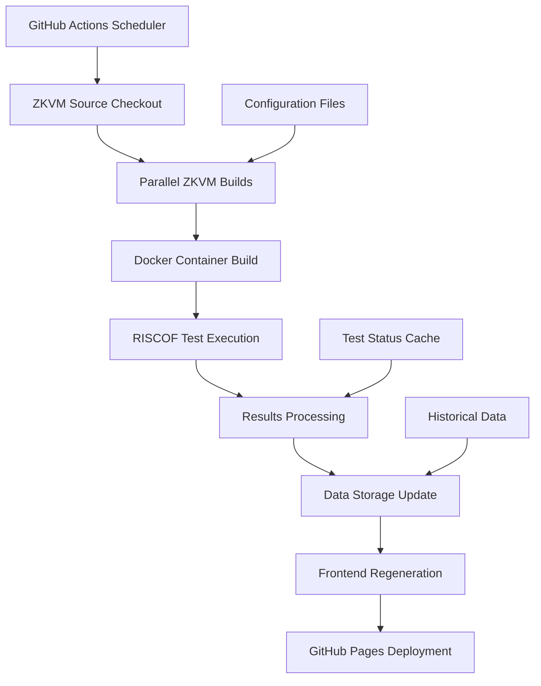
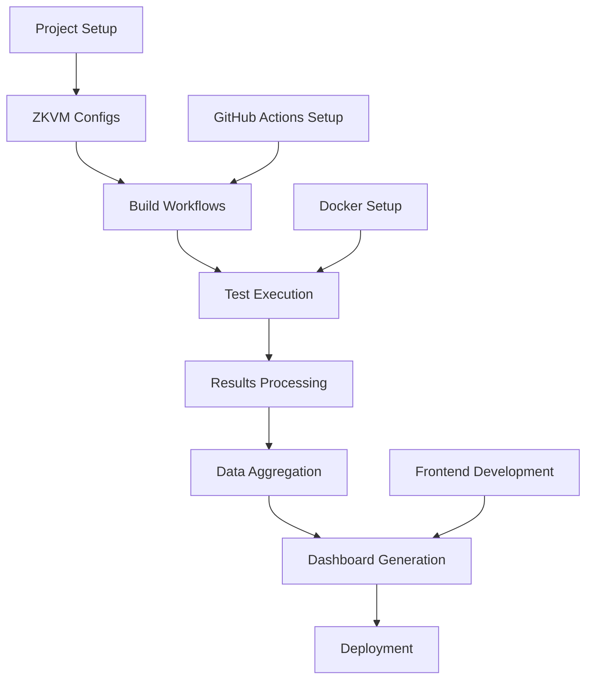

# ZKVM Compliance Testing Dashboard Implementation Plan

## Executive Summary

This plan outlines the implementation of a comprehensive ZKVM compliance testing dashboard system that leverages GitHub Actions for backend automation and GitHub Pages for frontend visualization. The system will provide nightly compliance testing for multiple ZKVM implementations (SP1, OpenVM, Jolt) against RISCOF test suites, with historical tracking and detailed reporting.

## 1. Project Architecture Overview

### 1.1 High-Level Architecture

```
┌─────────────────────────────────────────────────────────────────┐
│                        GitHub Repository                        │
├─────────────────────────────────────────────────────────────────┤
│  ┌─────────────────┐  ┌─────────────────┐  ┌─────────────────┐  │
│  │  GitHub Actions │  │   Data Storage  │  │  GitHub Pages   │  │
│  │   (Backend)     │  │ (JSON/Results)  │  │   (Frontend)    │  │
│  └─────────────────┘  └─────────────────┘  └─────────────────┘  │
│           │                       │                       │     │
│  ┌────────────────────────────────────────────────────────────┐ │
│  │              Orchestration Layer                           │ │
│  └────────────────────────────────────────────────────────────┘ │
│           │         │         │         │         │             │
│  ┌──────────┐ ┌──────────┐ ┌──────────┐ ┌──────────┐ ┌────────┐ │
│  │   SP1    │ │  OpenVM  │ │   Jolt   │ │  Docker  │ │ RISCOF │ │
│  │  Build   │ │  Build   │ │  Build   │ │ Runner   │ │ Tests  │ │
│  │  Script  │ │  Script  │ │  Script  │ │          │ │        │ │
│  └──────────┘ └──────────┘ └──────────┘ └──────────┘ └────────┘ │
└─────────────────────────────────────────────────────────────────┘
```

### 1.2 Data Flow Architecture



## 2. Directory Structure

### 2.1 Repository Organization

```
/home/cody/zkevm-test-monitor/
├── .github/
│   ├── workflows/
│   │   ├── nightly-compliance.yml          # Main orchestration workflow
│   │   ├── build-sp1.yml                   # SP1 build workflow
│   │   ├── build-openvm.yml                # OpenVM build workflow
│   │   ├── build-jolt.yml                  # Jolt build workflow
│   │   ├── run-tests.yml                   # Test execution workflow
│   │   └── deploy-dashboard.yml             # Frontend deployment workflow
│   └── scripts/
│       ├── build-zkvm.sh                   # Generic ZKVM build script
│       ├── run-riscof-tests.sh             # Test execution script
│       ├── process-results.sh              # Results processing script
│       └── generate-dashboard.sh           # Dashboard generation script
├── dashboard/
│   ├── index.html                          # Main dashboard page
│   ├── js/
│   │   ├── dashboard.js                    # Dashboard logic
│   │   ├── charts.js                       # Visualization components
│   │   └── utils.js                        # Utility functions
│   ├── css/
│   │   ├── dashboard.css                   # Dashboard styles
│   │   └── themes.css                      # Theme definitions
│   └── assets/
│       ├── icons/                          # Status icons
│       └── logos/                          # ZKVM logos
├── data/
│   ├── compliance/
│   │   ├── current.json                    # Latest compliance status
│   │   ├── history/
│   │   │   ├── 2025-01/                    # Monthly history
│   │   │   └── 2025-02/
│   │   └── archives/                       # 90-day retention
│   │       ├── sp1/                        # SP1 historical data
│   │       ├── openvm/                     # OpenVM historical data
│   │       └── jolt/                       # Jolt historical data
│   ├── configurations/
│   │   ├── zkvms.json                      # ZKVM configurations
│   │   └── test-suites.json               # Test suite definitions
│   └── cache/
│       ├── build-status.json              # Build cache
│       └── test-metadata.json             # Test metadata cache
├── configs/
│   ├── zkvm-configs/
│   │   ├── sp1.json                        # SP1 configuration
│   │   ├── openvm.json                     # OpenVM configuration
│   │   └── jolt.json                       # Jolt configuration
│   └── test-configs/
│       ├── riscof-base.yaml               # Base RISCOF configuration
│       └── test-matrix.yaml               # Test matrix definition
├── artifacts/
│   ├── binaries/                           # Built ZKVM binaries (cached)
│   ├── reports/                           # Generated RISCOF reports
│   └── logs/                              # Build and test logs
└── [existing files...]
```

## 3. Implementation Phases

### Phase 1: Foundation Infrastructure (Week 1-2)

#### 3.1 Core Configuration Setup

**Task 1.1: ZKVM Configuration Files**
- **File**: `/configs/zkvm-configs/sp1.json`
- **Dependencies**: None
- **Acceptance Criteria**:
  - JSON schema for ZKVM configuration
  - Repository URL, commit hash, build commands
  - Binary path specifications
  - Plugin mappings

```json
{
  "name": "SP1",
  "repository": "https://github.com/codygunton/sp1.git",
  "commit": "fc98075a",
  "build": {
    "command": "cargo build sp1-perf",
    "binary_path": "target/debug/sp1-perf-executor",
    "environment": {
      "RUST_LOG": "info"
    }
  },
  "plugin": {
    "name": "sp1",
    "path": "plugins/sp1"
  },
  "capabilities": {
    "note": "ISA information is determined from the plugin's ISA YAML file",
    "plugin_isa_file": "plugins/sp1/sp1_isa.yaml"
  }
}
```

**Task 1.2: GitHub Actions Base Structure**
- **File**: `.github/workflows/nightly-compliance.yml`
- **Dependencies**: Task 1.1
- **Acceptance Criteria**:
  - Scheduled trigger (nightly at 2 AM UTC)
  - Manual trigger capability
  - Environment variable setup
  - Artifact management strategy

**Task 1.3: Data Storage Schema**
- **File**: `data/schema/compliance-data.json`
- **Dependencies**: None
- **Acceptance Criteria**:
  - Standardized JSON schema for test results
  - Historical data format specification
  - Indexing strategy for efficient queries

### Phase 2: ZKVM Build Automation (Week 2-3)

#### 3.2 Parallel ZKVM Build Scripts

**Note**: The "builders" referenced here are GitHub Actions workflows and shell scripts that execute build commands, not Rust libraries or custom build tools. Each builder is a simple automation script that:
1. Clones the ZKVM repository at a specific commit
2. Runs the standard build command (e.g., `cargo build`)
3. Captures and uploads the resulting binary as an artifact

**Task 2.1: SP1 Build Workflow**
- **File**: `.github/workflows/build-sp1.yml`
- **Dependencies**: Task 1.1, 1.2
- **Acceptance Criteria**:
  - Checkout from specified commit
  - Rust toolchain setup
  - Cargo build with proper flags
  - Binary artifact upload
  - Build cache optimization

```yaml
name: Build SP1

on:
  workflow_call:
    inputs:
      commit_hash:
        required: true
        type: string
    outputs:
      artifact_name:
        value: ${{ jobs.build.outputs.artifact }}

jobs:
  build:
    runs-on: ubuntu-latest
    outputs:
      artifact: ${{ steps.artifact.outputs.name }}
    steps:
      - name: Checkout SP1
        uses: actions/checkout@v4
        with:
          repository: codygunton/sp1
          ref: ${{ inputs.commit_hash }}
          
      - name: Setup Rust
        uses: actions-rust-lang/setup-rust-toolchain@v1
        with:
          cache: true
          
      - name: Build SP1
        run: cargo build sp1-perf
        
      - name: Upload Binary
        uses: actions/upload-artifact@v4
        with:
          name: sp1-binary-${{ inputs.commit_hash }}
          path: target/debug/sp1-perf-executor
          retention-days: 7
```

**Task 2.2: OpenVM Build Workflow**
- **File**: `.github/workflows/build-openvm.yml`
- **Dependencies**: Task 1.1, 1.2
- **Acceptance Criteria**:
  - Similar structure to SP1 builder
  - Specific OpenVM build requirements
  - Release build optimization

**Task 2.3: Jolt Build Workflow**
- **File**: `.github/workflows/build-jolt.yml`
- **Dependencies**: Task 1.1, 1.2
- **Acceptance Criteria**:
  - Jolt-specific build process
  - Tracer binary compilation
  - Proper cargo workspace handling

**Task 2.4: Build Orchestration Script**
- **File**: `.github/scripts/build-zkvm.sh`
- **Dependencies**: Tasks 2.1-2.3
- **Acceptance Criteria**:
  - Generic build script for all ZKVMs
  - Configuration-driven build process
  - Error handling and retry logic

```bash
#!/bin/bash
# This is a shell script that runs build commands, not a Rust library
# It simply executes the standard cargo/make commands for each ZKVM
set -euo pipefail

ZKVM_NAME="$1"
CONFIG_FILE="configs/zkvm-configs/${ZKVM_NAME}.json"

# Parse configuration
REPO_URL=$(jq -r '.repository' "$CONFIG_FILE")
COMMIT_HASH=$(jq -r '.commit' "$CONFIG_FILE")
BUILD_CMD=$(jq -r '.build.command' "$CONFIG_FILE")
BINARY_PATH=$(jq -r '.build.binary_path' "$CONFIG_FILE")

echo "Building $ZKVM_NAME from $REPO_URL@$COMMIT_HASH"

# Checkout and build
git clone "$REPO_URL" "build-$ZKVM_NAME"
cd "build-$ZKVM_NAME"
git checkout "$COMMIT_HASH"

# Set up environment
while IFS="=" read -r key value; do
  export "$key=$value"
done < <(jq -r '.build.environment | to_entries | .[] | "\(.key)=\(.value)"' "../$CONFIG_FILE")

# Execute build
eval "$BUILD_CMD"

# Verify binary exists
if [[ ! -f "$BINARY_PATH" ]]; then
  echo "Error: Binary not found at $BINARY_PATH"
  exit 1
fi

echo "Build completed successfully"
```

### Phase 3: Test Execution Engine (Week 3-4)

#### 3.3 RISCOF Test Integration

**Important Note**: The ISA (Instruction Set Architecture) information for each ZKVM is not hardcoded in our configuration. Instead, it is automatically extracted from the plugin's ISA YAML file (e.g., `plugins/sp1/sp1_isa.yaml`). The RISCOF framework reads these plugin specifications to determine what tests to run and what ISA extensions are supported.

**Task 3.1: Test Execution Workflow**
- **File**: `.github/workflows/run-tests.yml`
- **Dependencies**: Phase 2 completion
- **Acceptance Criteria**:
  - Docker container integration
  - Multi-ZKVM test matrix
  - Parallel test execution
  - Result artifact collection

```yaml
name: Run RISCOF Tests

on:
  workflow_call:
    inputs:
      zkvm_artifacts:
        required: true
        type: string
    outputs:
      results_artifact:
        value: ${{ jobs.test.outputs.results }}

jobs:
  test:
    runs-on: ubuntu-latest
    strategy:
      matrix:
        zkvm: [sp1, openvm, jolt]
      fail-fast: false
    outputs:
      results: ${{ steps.results.outputs.name }}
    steps:
      - name: Checkout Repository
        uses: actions/checkout@v4
        
      - name: Download ZKVM Binary
        uses: actions/download-artifact@v4
        with:
          name: ${{ matrix.zkvm }}-binary
          path: binaries/
          
      - name: Build Docker Container
        run: docker build -t riscof:latest .
        
      - name: Run RISCOF Tests
        run: |
          docker run --rm \
            -v "$PWD/plugins/${{ matrix.zkvm }}:/dut/plugin" \
            -v "$PWD/binaries:/dut/bin" \
            -v "$PWD/results/${{ matrix.zkvm }}:/riscof/riscof_work" \
            riscof:latest
            
      - name: Upload Results
        uses: actions/upload-artifact@v4
        with:
          name: riscof-results-${{ matrix.zkvm }}
          path: results/${{ matrix.zkvm }}/
          retention-days: 90
```

**Task 3.2: Results Processing Pipeline**
- **File**: `.github/scripts/process-results.sh`
- **Dependencies**: Task 3.1
- **Acceptance Criteria**:
  - Parse RISCOF HTML reports
  - Extract pass/fail statistics
  - Generate JSON summary data
  - Timestamp and version tracking

```bash
#!/bin/bash
set -euo pipefail

ZKVM_NAME="$1"
RESULTS_DIR="results/$ZKVM_NAME"
OUTPUT_DIR="data/compliance"

# Parse RISCOF report
REPORT_FILE="$RESULTS_DIR/report.html"
if [[ ! -f "$REPORT_FILE" ]]; then
  echo "Error: Report file not found: $REPORT_FILE"
  exit 1
fi

# Extract statistics using HTML parsing
TOTAL_TESTS=$(grep -o "Total Tests: [0-9]*" "$REPORT_FILE" | grep -o "[0-9]*")
PASSED_TESTS=$(grep -o "Passed: [0-9]*" "$REPORT_FILE" | grep -o "[0-9]*")
FAILED_TESTS=$(grep -o "Failed: [0-9]*" "$REPORT_FILE" | grep -o "[0-9]*")

# Calculate metrics
PASS_RATE=$(echo "scale=2; $PASSED_TESTS * 100 / $TOTAL_TESTS" | bc)
TIMESTAMP=$(date -u +"%Y-%m-%dT%H:%M:%SZ")

# Generate JSON result
cat > "$OUTPUT_DIR/results-$ZKVM_NAME.json" << EOF
{
  "zkvm": "$ZKVM_NAME",
  "timestamp": "$TIMESTAMP",
  "commit": "$(git rev-parse HEAD)",
  "statistics": {
    "total_tests": $TOTAL_TESTS,
    "passed_tests": $PASSED_TESTS,
    "failed_tests": $FAILED_TESTS,
    "pass_rate": $PASS_RATE
  },
  "artifacts": {
    "report_path": "$REPORT_FILE",
    "log_path": "$RESULTS_DIR/riscof.log"
  }
}
EOF

echo "Results processed for $ZKVM_NAME: $PASSED_TESTS/$TOTAL_TESTS tests passed ($PASS_RATE%)"
```

**Task 3.3: Data Aggregation System**
- **File**: `.github/scripts/aggregate-results.py`
- **Dependencies**: Task 3.2
- **Acceptance Criteria**:
  - Combine individual ZKVM results
  - Update historical data
  - Generate dashboard data files
  - Maintain data integrity

```python
#!/usr/bin/env python3
import json
import os
from datetime import datetime
from pathlib import Path

def aggregate_results():
    """Aggregate RISCOF test results for all ZKVMs."""
    
    results_dir = Path("data/compliance")
    results_dir.mkdir(parents=True, exist_ok=True)
    
    # Load individual results
    zkvm_results = {}
    for zkvm in ["sp1", "openvm", "jolt"]:
        result_file = results_dir / f"results-{zkvm}.json"
        if result_file.exists():
            with open(result_file) as f:
                zkvm_results[zkvm] = json.load(f)
    
    # Generate current status
    current_status = {
        "generated_at": datetime.utcnow().isoformat() + "Z",
        "zkvms": zkvm_results,
        "summary": calculate_summary(zkvm_results)
    }
    
    # Write current status
    with open(results_dir / "current.json", "w") as f:
        json.dump(current_status, f, indent=2)
    
    # Update historical data
    update_historical_data(current_status)
    
    print(f"Aggregated results for {len(zkvm_results)} ZKVMs")

def calculate_summary(zkvm_results):
    """Calculate aggregate statistics."""
    total_tests = sum(r["statistics"]["total_tests"] for r in zkvm_results.values())
    total_passed = sum(r["statistics"]["passed_tests"] for r in zkvm_results.values())
    
    return {
        "total_tests": total_tests,
        "total_passed": total_passed,
        "overall_pass_rate": round(total_passed * 100 / total_tests, 2) if total_tests > 0 else 0,
        "zkvm_count": len(zkvm_results)
    }

def update_historical_data(current_status):
    """Update historical data with current results."""
    today = datetime.now().strftime("%Y-%m-%d")
    history_dir = Path("data/compliance/history") / today[:7]  # YYYY-MM
    history_dir.mkdir(parents=True, exist_ok=True)
    
    history_file = history_dir / f"{today}.json"
    with open(history_file, "w") as f:
        json.dump(current_status, f, indent=2)

if __name__ == "__main__":
    aggregate_results()
```

### Phase 4: Frontend Dashboard (Week 4-5)

#### 4.1 Dashboard Implementation

**Task 4.1: Main Dashboard HTML**
- **File**: `dashboard/index.html`
- **Dependencies**: Phase 3 completion
- **Acceptance Criteria**:
  - Responsive design
  - Real-time status display
  - Historical trend visualization
  - ZKVM-specific detail views

```html
<!DOCTYPE html>
<html lang="en">
<head>
    <meta charset="UTF-8">
    <meta name="viewport" content="width=device-width, initial-scale=1.0">
    <title>ZKVM Compliance Dashboard</title>
    <link rel="stylesheet" href="css/dashboard.css">
    <script src="https://cdn.jsdelivr.net/npm/chart.js"></script>
</head>
<body>
    <header class="dashboard-header">
        <h1>ZKVM Compliance Testing Dashboard</h1>
        <div class="last-updated" id="lastUpdated"></div>
    </header>
    
    <main class="dashboard-main">
        <section class="summary-section">
            <div class="summary-card">
                <h2>Overall Status</h2>
                <div class="metric-grid" id="overallMetrics"></div>
            </div>
        </section>
        
        <section class="zkvm-section">
            <h2>ZKVM Status</h2>
            <div class="zkvm-grid" id="zkvmGrid"></div>
        </section>
        
        <section class="trends-section">
            <h2>Historical Trends</h2>
            <canvas id="trendsChart" width="800" height="400"></canvas>
        </section>
        
        <section class="details-section">
            <h2>Test Details</h2>
            <div class="details-grid" id="detailsGrid"></div>
        </section>
    </main>
    
    <script src="js/utils.js"></script>
    <script src="js/charts.js"></script>
    <script src="js/dashboard.js"></script>
</body>
</html>
```

**Task 4.2: Dashboard JavaScript Logic**
- **File**: `dashboard/js/dashboard.js`
- **Dependencies**: Task 4.1
- **Acceptance Criteria**:
  - Data fetching from JSON APIs
  - Dynamic content rendering
  - Real-time updates
  - Interactive filtering

```javascript
class ComplianceDashboard {
    constructor() {
        this.data = null;
        this.historicalData = [];
        this.init();
    }
    
    async init() {
        try {
            await this.loadData();
            this.renderDashboard();
            this.startAutoRefresh();
        } catch (error) {
            console.error('Failed to initialize dashboard:', error);
            this.showError('Failed to load dashboard data');
        }
    }
    
    async loadData() {
        // Load current status
        const response = await fetch('data/compliance/current.json');
        this.data = await response.json();
        
        // Load historical data (last 90 days)
        const historyPromises = [];
        for (let i = 0; i < 30; i++) {
            const date = new Date();
            date.setDate(date.getDate() - i);
            const dateStr = date.toISOString().split('T')[0];
            const monthStr = dateStr.substring(0, 7);
            
            historyPromises.push(
                fetch(`data/compliance/history/${monthStr}/${dateStr}.json`)
                    .then(r => r.ok ? r.json() : null)
                    .catch(() => null)
            );
        }
        
        const historyResults = await Promise.all(historyPromises);
        this.historicalData = historyResults.filter(d => d !== null);
    }
    
    renderDashboard() {
        this.renderSummary();
        this.renderZKVMStatus();
        this.renderTrends();
        this.renderDetails();
        this.updateTimestamp();
    }
    
    renderSummary() {
        const container = document.getElementById('overallMetrics');
        const summary = this.data.summary;
        
        container.innerHTML = `
            <div class="metric">
                <div class="metric-value">${summary.total_tests}</div>
                <div class="metric-label">Total Tests</div>
            </div>
            <div class="metric">
                <div class="metric-value">${summary.total_passed}</div>
                <div class="metric-label">Tests Passed</div>
            </div>
            <div class="metric">
                <div class="metric-value">${summary.overall_pass_rate}%</div>
                <div class="metric-label">Pass Rate</div>
            </div>
            <div class="metric">
                <div class="metric-value">${summary.zkvm_count}</div>
                <div class="metric-label">ZKVMs Tested</div>
            </div>
        `;
    }
    
    renderZKVMStatus() {
        const container = document.getElementById('zkvmGrid');
        const zkvms = this.data.zkvms;
        
        container.innerHTML = Object.entries(zkvms).map(([name, data]) => {
            const stats = data.statistics;
            const status = stats.pass_rate >= 95 ? 'success' : 
                          stats.pass_rate >= 80 ? 'warning' : 'error';
            
            return `
                <div class="zkvm-card ${status}">
                    <h3>${name.toUpperCase()}</h3>
                    <div class="zkvm-metrics">
                        <div class="metric">
                            <span class="value">${stats.passed_tests}/${stats.total_tests}</span>
                            <span class="label">Tests Passed</span>
                        </div>
                        <div class="metric">
                            <span class="value">${stats.pass_rate}%</span>
                            <span class="label">Pass Rate</span>
                        </div>
                    </div>
                    <div class="zkvm-actions">
                        <a href="data/compliance/archives/${name}/" target="_blank">View History</a>
                        <a href="#" onclick="showDetails('${name}')">Details</a>
                    </div>
                </div>
            `;
        }).join('');
    }
    
    renderTrends() {
        if (this.historicalData.length === 0) return;
        
        const ctx = document.getElementById('trendsChart').getContext('2d');
        const chartData = this.prepareChartData();
        
        new Chart(ctx, {
            type: 'line',
            data: chartData,
            options: {
                responsive: true,
                scales: {
                    y: {
                        beginAtZero: true,
                        max: 100,
                        title: {
                            display: true,
                            text: 'Pass Rate (%)'
                        }
                    },
                    x: {
                        title: {
                            display: true,
                            text: 'Date'
                        }
                    }
                },
                plugins: {
                    title: {
                        display: true,
                        text: 'ZKVM Compliance Trends (Last 90 Days)'
                    },
                    legend: {
                        display: true
                    }
                }
            }
        });
    }
    
    prepareChartData() {
        const dates = this.historicalData.map(d => d.generated_at.split('T')[0]).reverse();
        const zkvmNames = Object.keys(this.data.zkvms);
        const colors = ['#FF6384', '#36A2EB', '#FFCE56'];
        
        return {
            labels: dates,
            datasets: zkvmNames.map((zkvm, index) => ({
                label: zkvm.toUpperCase(),
                data: this.historicalData.map(d => 
                    d.zkvms[zkvm]?.statistics?.pass_rate || 0
                ).reverse(),
                borderColor: colors[index % colors.length],
                backgroundColor: colors[index % colors.length] + '20',
                fill: false,
                tension: 0.1
            }))
        };
    }
    
    updateTimestamp() {
        const element = document.getElementById('lastUpdated');
        const timestamp = new Date(this.data.generated_at);
        element.textContent = `Last updated: ${timestamp.toLocaleString()}`;
    }
    
    startAutoRefresh() {
        // Refresh every 5 minutes
        setInterval(() => {
            this.loadData().then(() => this.renderDashboard());
        }, 5 * 60 * 1000);
    }
    
    showError(message) {
        document.body.innerHTML = `
            <div class="error-container">
                <h1>Dashboard Error</h1>
                <p>${message}</p>
                <button onclick="location.reload()">Retry</button>
            </div>
        `;
    }
}

// Initialize dashboard when DOM is ready
document.addEventListener('DOMContentLoaded', () => {
    new ComplianceDashboard();
});

// Global functions for interaction
function showDetails(zkvm) {
    // Implementation for detailed view
    console.log(`Showing details for ${zkvm}`);
}
```

**Task 4.3: Dashboard Styling**
- **File**: `dashboard/css/dashboard.css`
- **Dependencies**: Task 4.1, 4.2
- **Acceptance Criteria**:
  - Modern, responsive design
  - Status color coding
  - Mobile-friendly layout
  - Accessibility compliance

### Phase 5: Orchestration & Automation (Week 5-6)

#### 5.1 Main Workflow Integration

**Task 5.1: Master Orchestration Workflow**
- **File**: `.github/workflows/nightly-compliance.yml`
- **Dependencies**: All previous phases
- **Acceptance Criteria**:
  - Coordinated execution of all sub-workflows
  - Proper dependency management
  - Error handling and notifications
  - Artifact lifecycle management

```yaml
name: Nightly ZKVM Compliance Testing

on:
  schedule:
    - cron: '0 2 * * *'  # Daily at 2 AM UTC
  workflow_dispatch:      # Manual trigger
    inputs:
      force_rebuild:
        description: 'Force rebuild of all ZKVMs'
        required: false
        default: false
        type: boolean

env:
  DOCKER_REGISTRY: ghcr.io
  FORCE_REBUILD: ${{ github.event.inputs.force_rebuild || false }}

jobs:
  prepare:
    name: Prepare Execution Environment
    runs-on: ubuntu-latest
    outputs:
      matrix: ${{ steps.matrix.outputs.matrix }}
      should_build: ${{ steps.check.outputs.should_build }}
    steps:
      - name: Checkout Repository
        uses: actions/checkout@v4
        
      - name: Load ZKVM Configurations
        id: matrix
        run: |
          MATRIX=$(cat configs/zkvm-configs/*.json | jq -s .)
          echo "matrix=${MATRIX}" >> $GITHUB_OUTPUT
          
      - name: Check Build Requirements
        id: check
        run: |
          # Check if builds are needed (force rebuild or missing artifacts)
          SHOULD_BUILD="true"
          if [[ "$FORCE_REBUILD" == "false" ]]; then
            # Logic to check existing artifacts
            SHOULD_BUILD="false"  # Implement artifact checking logic
          fi
          echo "should_build=${SHOULD_BUILD}" >> $GITHUB_OUTPUT

  build_zkvms:
    name: Build ZKVMs
    needs: prepare
    if: needs.prepare.outputs.should_build == 'true'
    strategy:
      matrix:
        zkvm: [sp1, openvm, jolt]
      fail-fast: false
    uses: ./.github/workflows/build-${{ matrix.zkvm }}.yml
    with:
      commit_hash: ${{ fromJson(needs.prepare.outputs.matrix)[matrix.zkvm].commit }}

  build_docker:
    name: Build Test Container
    runs-on: ubuntu-latest
    steps:
      - name: Checkout Repository
        uses: actions/checkout@v4
        
      - name: Build Docker Image
        run: |
          docker build -t riscof:latest .
          docker save riscof:latest | gzip > riscof-container.tar.gz
          
      - name: Upload Container
        uses: actions/upload-artifact@v4
        with:
          name: riscof-container
          path: riscof-container.tar.gz
          retention-days: 1

  run_tests:
    name: Execute RISCOF Tests
    needs: [prepare, build_zkvms, build_docker]
    if: always() && (needs.build_zkvms.result == 'success' || needs.build_zkvms.result == 'skipped')
    strategy:
      matrix:
        zkvm: [sp1, openvm, jolt]
      fail-fast: false
    runs-on: ubuntu-latest
    steps:
      - name: Checkout Repository
        uses: actions/checkout@v4
        
      - name: Download ZKVM Binary
        uses: actions/download-artifact@v4
        with:
          name: ${{ matrix.zkvm }}-binary
          path: binaries/
          
      - name: Download Container
        uses: actions/download-artifact@v4
        with:
          name: riscof-container
          path: .
          
      - name: Load Container
        run: |
          docker load < riscof-container.tar.gz
          
      - name: Run Tests
        run: |
          mkdir -p results/${{ matrix.zkvm }}
          docker run --rm \
            -v "$PWD/plugins/${{ matrix.zkvm }}:/dut/plugin" \
            -v "$PWD/binaries:/dut/bin" \
            -v "$PWD/results/${{ matrix.zkvm }}:/riscof/riscof_work" \
            riscof:latest
            
      - name: Process Results
        run: .github/scripts/process-results.sh ${{ matrix.zkvm }}
        
      - name: Upload Results
        uses: actions/upload-artifact@v4
        with:
          name: results-${{ matrix.zkvm }}
          path: |
            results/${{ matrix.zkvm }}/
            data/compliance/results-${{ matrix.zkvm }}.json
          retention-days: 90

  aggregate_results:
    name: Aggregate and Process Results
    needs: run_tests
    if: always() && needs.run_tests.result != 'cancelled'
    runs-on: ubuntu-latest
    steps:
      - name: Checkout Repository
        uses: actions/checkout@v4
        with:
          token: ${{ secrets.GITHUB_TOKEN }}
          
      - name: Download All Results
        uses: actions/download-artifact@v4
        with:
          pattern: results-*
          merge-multiple: true
          
      - name: Aggregate Results
        run: python3 .github/scripts/aggregate-results.py
        
      - name: Commit Results
        run: |
          git config --local user.email "action@github.com"
          git config --local user.name "GitHub Action"
          git add data/compliance/
          if git diff --staged --quiet; then
            echo "No changes to commit"
          else
            git commit -m "Update compliance data - $(date -u '+%Y-%m-%d %H:%M:%S UTC')"
            git push
          fi

  deploy_dashboard:
    name: Deploy Dashboard
    needs: aggregate_results
    if: always() && needs.aggregate_results.result == 'success'
    uses: ./.github/workflows/deploy-dashboard.yml

  notify:
    name: Send Notifications
    needs: [run_tests, aggregate_results, deploy_dashboard]
    if: always()
    runs-on: ubuntu-latest
    steps:
      - name: Calculate Status
        id: status
        run: |
          if [[ "${{ needs.run_tests.result }}" == "success" && "${{ needs.aggregate_results.result }}" == "success" ]]; then
            echo "status=success" >> $GITHUB_OUTPUT
            echo "message=All ZKVM compliance tests completed successfully" >> $GITHUB_OUTPUT
          else
            echo "status=failure" >> $GITHUB_OUTPUT
            echo "message=ZKVM compliance testing encountered failures" >> $GITHUB_OUTPUT
          fi
          
      - name: Create Issue on Failure
        if: steps.status.outputs.status == 'failure'
        uses: actions/github-script@v7
        with:
          script: |
            github.rest.issues.create({
              owner: context.repo.owner,
              repo: context.repo.repo,
              title: 'Nightly Compliance Test Failure - ' + new Date().toISOString().split('T')[0],
              body: 'The nightly ZKVM compliance tests have failed. Please check the workflow logs for details.\n\nWorkflow: ' + context.payload.workflow + '\nRun: ' + context.runNumber,
              labels: ['bug', 'compliance-test', 'automated']
            });
```

**Task 5.2: Dashboard Deployment Workflow**
- **File**: `.github/workflows/deploy-dashboard.yml`
- **Dependencies**: Task 5.1
- **Acceptance Criteria**:
  - GitHub Pages deployment
  - Static site generation
  - Cache management
  - Performance optimization

```yaml
name: Deploy Dashboard

on:
  workflow_call:
  push:
    paths:
      - 'dashboard/**'
      - 'data/compliance/**'

permissions:
  contents: read
  pages: write
  id-token: write

concurrency:
  group: "pages"
  cancel-in-progress: false

jobs:
  build:
    runs-on: ubuntu-latest
    steps:
      - name: Checkout
        uses: actions/checkout@v4
        
      - name: Setup Pages
        uses: actions/configure-pages@v4
        
      - name: Optimize Assets
        run: |
          # Minify CSS and JS files
          for css_file in dashboard/css/*.css; do
            echo "/* Minified $(date) */" > "${css_file}.min"
            cat "$css_file" | tr -d '\n\t' | sed 's/  */ /g' >> "${css_file}.min"
            mv "${css_file}.min" "$css_file"
          done
          
          # Copy data files to dashboard
          cp -r data/ dashboard/
          
      - name: Upload artifact
        uses: actions/upload-pages-artifact@v3
        with:
          path: './dashboard'

  deploy:
    environment:
      name: github-pages
      url: ${{ steps.deployment.outputs.page_url }}
    runs-on: ubuntu-latest
    needs: build
    steps:
      - name: Deploy to GitHub Pages
        id: deployment
        uses: actions/deploy-pages@v4
```

## 4. Dependency Tree Analysis

### 4.1 Critical Path Dependencies



### 4.2 Parallelization Opportunities

**Parallel Track 1: Infrastructure**
- ZKVM configuration files
- GitHub Actions workflow templates
- Docker container setup
- Repository structure creation

**Parallel Track 2: Build System**
- SP1 build workflow
- OpenVM build workflow  
- Jolt build workflow
- Build script optimization

**Parallel Track 3: Testing Framework**
- RISCOF integration
- Results processing scripts
- Data aggregation system
- Historical data management

**Parallel Track 4: Frontend**
- Dashboard HTML structure
- JavaScript functionality
- CSS styling and themes
- Chart visualization components

## 5. Configuration Management

### 5.1 ZKVM-Specific Configurations

**SP1 Configuration** (`configs/zkvm-configs/sp1.json`):
```json
{
  "name": "SP1",
  "display_name": "Succinct SP1",
  "repository": "https://github.com/codygunton/sp1.git",
  "commit": "fc98075a",
  "build": {
    "command": "cargo build sp1-perf",
    "binary_path": "target/debug/sp1-perf-executor",
    "environment": {
      "RUST_LOG": "info",
      "CARGO_TARGET_DIR": "target"
    },
    "cache_key": "sp1-${commit}-${rust_version}"
  },
  "plugin": {
    "name": "sp1",
    "path": "plugins/sp1",
    "isa_file": "sp1_isa.yaml",
    "platform_file": "sp1_platform.yaml"
  },
  "capabilities": {
    "isa": "rv64i",
    "extensions": ["m", "a", "c"],
    "memory_model": "unified",
    "endianness": "little"
  },
  "test_config": {
    "timeout": 300,
    "parallel_jobs": 4,
    "retry_count": 3
  }
}
```

**OpenVM Configuration** (`configs/zkvm-configs/openvm.json`):
```json
{
  "name": "OpenVM",
  "display_name": "OpenVM zkVM",
  "repository": "https://github.com/codygunton/openvm.git", 
  "commit": "a6f77215f",
  "build": {
    "command": "cargo build --release",
    "binary_path": "target/release/cargo-openvm",
    "environment": {
      "RUST_LOG": "info"
    }
  },
  "plugin": {
    "name": "openvm",
    "path": "plugins/openvm"
  },
  "capabilities": {
    "isa": "rv64i",
    "extensions": ["m", "a", "c"]
  }
}
```

**Jolt Configuration** (`configs/zkvm-configs/jolt.json`):
```json
{
  "name": "Jolt", 
  "display_name": "Jolt zkVM",
  "repository": "https://github.com/codygunton/jolt.git",
  "commit": "c4b9b060",
  "build": {
    "command": "cargo build --release -p tracer --bin jolt-emu",
    "binary_path": "target/release/jolt-emu",
    "environment": {
      "RUST_LOG": "info"
    }
  },
  "plugin": {
    "name": "jolt", 
    "path": "plugins/jolt"
  },
  "capabilities": {
    "isa": "rv64i",
    "extensions": ["m", "a", "c"]
  }
}
```

### 5.2 Test Matrix Configuration

**Test Matrix** (`configs/test-configs/test-matrix.yaml`):
```yaml
test_suites:
  riscv_compliance:
    name: "RISC-V Architectural Tests"
    version: "v3.9.1"
    categories:
      - rv64i_m
      - rv64i_m_a
      - rv64i_m_a_c
    parallel_execution: true
    max_parallel_jobs: 8

zkvm_matrix:
  sp1:
    enabled: true
    test_suites: [riscv_compliance]
    build_cache: true
    
  openvm:
    enabled: true
    test_suites: [riscv_compliance]
    build_cache: true
    
  jolt:
    enabled: true
    test_suites: [riscv_compliance] 
    build_cache: true

execution_config:
  timeout:
    build: 1800  # 30 minutes
    test: 3600   # 60 minutes
  retries:
    build_failure: 2
    test_failure: 1
  cache:
    build_artifacts: 7   # days
    test_results: 30     # days
```

## 6. Performance Optimization

### 6.1 Build Optimization Strategies

**Caching Strategy**:
- Cargo build cache per ZKVM and commit hash
- Docker layer caching for base image
- Artifact caching with expiration policies
- Incremental builds when possible

**Parallelization**:
- Concurrent ZKVM builds using matrix strategy
- Parallel test execution within each ZKVM
- Async dashboard generation during test execution

### 6.2 Resource Management

**GitHub Actions Limits**:
- Maximum 20 concurrent jobs per repository
- 6-hour timeout per job
- Artifact storage limits and cleanup
- API rate limiting considerations

**Optimization Approach**:
```yaml
# Optimized resource allocation
strategy:
  matrix:
    zkvm: [sp1, openvm, jolt]
  max-parallel: 3
  fail-fast: false

# Efficient artifact management  
- name: Cleanup Old Artifacts
  run: |
    # Delete build artifacts older than 7 days
    # Delete test results and historical data older than 90 days
    # This ensures 90-day retention for all compliance data
    gh api --paginate repos/${{ github.repository }}/actions/artifacts \
      --jq '.artifacts[] | select(.created_at < (now - 7*24*3600 | strftime("%Y-%m-%dT%H:%M:%SZ"))) | .id' \
      | xargs -I {} gh api repos/${{ github.repository }}/actions/artifacts/{} -X DELETE
```

## 7. Data Storage Strategy

### 7.1 Repository-Based Storage

**Current Data** (`data/compliance/current.json`):
- Latest test results for all ZKVMs
- Generated timestamps and metadata
- Summary statistics and pass rates
- Links to detailed reports

**Historical Data** (`data/compliance/history/YYYY-MM/YYYY-MM-DD.json`):
- Daily snapshots of test results
- Organized by year/month for efficient access
- Retention policy of 2 years
- Compressed storage for older data

**Archive Data** (`data/compliance/archives/zkvm/`):
- Detailed test artifacts per ZKVM
- RISCOF HTML reports
- Build logs and error reports
- Organized by ZKVM and date

### 7.2 Data Schema

**Current Status Schema**:
```json
{
  "generated_at": "2025-01-15T02:30:00Z",
  "version": "1.0",
  "zkvms": {
    "sp1": {
      "zkvm": "sp1",
      "timestamp": "2025-01-15T02:25:00Z", 
      "commit": "fc98075a",
      "build_status": "success",
      "statistics": {
        "total_tests": 1247,
        "passed_tests": 1189,
        "failed_tests": 58,
        "pass_rate": 95.35,
        "test_categories": {
          "rv64i_m": {"total": 415, "passed": 415},
          "rv64i_m_a": {"total": 416, "passed": 398}, 
          "rv64i_m_a_c": {"total": 416, "passed": 376}
        }
      },
      "artifacts": {
        "report_url": "data/compliance/archives/sp1/2025-01-15/report.html",
        "log_url": "data/compliance/archives/sp1/2025-01-15/build.log",
        "binary_hash": "sha256:abc123..."
      },
      "performance": {
        "build_time": 245,  # seconds
        "test_time": 1834,   # seconds
        "total_time": 2079
      }
    }
  },
  "summary": {
    "total_tests": 3741,
    "total_passed": 3567, 
    "overall_pass_rate": 95.35,
    "zkvm_count": 3,
    "test_duration": 3600,
    "status": "completed"
  },
  "metadata": {
    "workflow_run": "1234567",
    "github_sha": "abcd1234",
    "environment": "production"
  }
}
```

## 8. Monitoring and Alerting

### 8.1 Failure Detection

**Build Failures**:
- Automatic retry with exponential backoff
- Issue creation for persistent failures
- Slack/email notifications for critical failures
- Build cache invalidation strategies

**Test Failures**:
- Pass rate threshold monitoring (< 90% triggers alert)
- New test failure detection
- Regression analysis between commits
- Performance degradation alerts

### 8.2 Health Monitoring

**System Health Checks**:
```bash
#!/bin/bash
# Health check script (.github/scripts/health-check.sh)

check_data_freshness() {
    local current_file="data/compliance/current.json"
    local max_age_hours=25  # Allow 1 hour buffer for daily runs
    
    if [[ ! -f "$current_file" ]]; then
        echo "ERROR: Current data file missing"
        return 1
    fi
    
    local file_age=$(( ($(date +%s) - $(stat -c %Y "$current_file")) / 3600 ))
    if (( file_age > max_age_hours )); then
        echo "ERROR: Data is ${file_age} hours old (max: ${max_age_hours})"
        return 1
    fi
    
    echo "OK: Data is ${file_age} hours old"
}

check_zkvm_status() {
    local zkvm="$1"
    local pass_rate=$(jq -r ".zkvms.${zkvm}.statistics.pass_rate" data/compliance/current.json)
    
    if [[ "$pass_rate" == "null" ]]; then
        echo "ERROR: No data for $zkvm"
        return 1
    fi
    
    if (( $(echo "$pass_rate < 80" | bc -l) )); then
        echo "WARNING: $zkvm pass rate is ${pass_rate}% (below 80%)"
        return 1
    fi
    
    echo "OK: $zkvm pass rate is ${pass_rate}%"
}

# Run health checks
check_data_freshness
for zkvm in sp1 openvm jolt; do
    check_zkvm_status "$zkvm"
done
```

**Dashboard Monitoring**:
- Page load performance tracking
- Data API availability monitoring
- Chart rendering error detection
- Mobile compatibility testing

## 9. Security Considerations

### 9.1 Repository Security

**Access Controls**:
- Protected main branch requiring PR reviews
- Required status checks for deployment
- Signed commits enforcement
- Dependabot security updates

**Secrets Management**:
- GitHub tokens with minimal required permissions
- No external API keys required
- Environment-specific configurations
- Audit logging for sensitive operations

### 9.2 Build Security

**Container Security**:
- Base image security scanning
- Dependency vulnerability checks
- Runtime security policies
- Network isolation during builds

**Code Execution**:
- Sandboxed test execution
- Resource limiting for test runs
- Input validation for configuration files
- Safe handling of external repository clones

## 10. Testing Strategy

### 10.1 System Testing

**Integration Tests**:
```yaml
# .github/workflows/test-system.yml
name: System Integration Tests

on:
  pull_request:
    paths:
      - '.github/workflows/**'
      - '.github/scripts/**'
      - 'configs/**'

jobs:
  test_workflows:
    runs-on: ubuntu-latest
    steps:
      - uses: actions/checkout@v4
      
      - name: Test Configuration Loading
        run: |
          for config in configs/zkvm-configs/*.json; do
            echo "Testing $config"
            jq . "$config" > /dev/null
          done
          
      - name: Test Build Scripts
        run: |
          bash -n .github/scripts/build-zkvm.sh
          bash -n .github/scripts/process-results.sh
          
      - name: Test Data Processing
        run: |
          python3 -m py_compile .github/scripts/aggregate-results.py
```

**Frontend Testing**:
```javascript
// dashboard/tests/dashboard.test.js
describe('ComplianceDashboard', () => {
    let dashboard;
    
    beforeEach(() => {
        // Mock fetch API
        global.fetch = jest.fn();
        dashboard = new ComplianceDashboard();
    });
    
    test('loads current data correctly', async () => {
        const mockData = {
            generated_at: '2025-01-15T02:30:00Z',
            zkvms: { sp1: { statistics: { pass_rate: 95.35 } } },
            summary: { overall_pass_rate: 95.35 }
        };
        
        fetch.mockResolvedValue({
            json: () => Promise.resolve(mockData)
        });
        
        await dashboard.loadData();
        expect(dashboard.data).toEqual(mockData);
    });
    
    test('renders ZKVM status correctly', () => {
        dashboard.data = {
            zkvms: {
                sp1: { statistics: { passed_tests: 100, total_tests: 105, pass_rate: 95.24 } }
            }
        };
        
        dashboard.renderZKVMStatus();
        const container = document.getElementById('zkvmGrid');
        expect(container.innerHTML).toContain('SP1');
        expect(container.innerHTML).toContain('95.24%');
    });
});
```

### 10.2 Performance Testing

**Load Testing**:
- Dashboard performance with large datasets
- GitHub Actions workflow timing optimization
- Data processing efficiency analysis
- Memory usage during test execution

**Stress Testing**:
- Multiple concurrent workflow executions
- Large historical data processing
- Dashboard responsiveness under load
- Error recovery mechanisms

## 11. Deployment Plan

### 11.1 Rollout Strategy

**Phase 1: Foundation (Week 1-2)**
1. Repository structure setup
2. Basic GitHub Actions workflows
3. Simple Docker container build
4. Initial configuration files

**Phase 2: Core Functionality (Week 3-4)**
1. ZKVM build automation
2. RISCOF test integration
3. Results processing pipeline
4. Basic data storage

**Phase 3: Dashboard Development (Week 4-5)**
1. Frontend HTML structure
2. JavaScript functionality
3. CSS styling and responsive design
4. Chart visualization integration

**Phase 4: Integration & Testing (Week 5-6)**
1. End-to-end workflow testing
2. Performance optimization
3. Error handling implementation
4. Security review and hardening

**Phase 5: Production Deployment (Week 6)**
1. GitHub Pages setup
2. DNS configuration (if custom domain)
3. Monitoring implementation
4. Documentation completion

### 11.2 Validation Criteria

**Functional Validation**:
- [ ] All three ZKVMs build successfully
- [ ] RISCOF tests execute without errors
- [ ] Results are processed and stored correctly
- [ ] Dashboard displays current status accurately
- [ ] Historical data is maintained properly
- [ ] GitHub Pages deploys successfully

**Performance Validation**:
- [ ] Complete workflow execution < 2 hours
- [ ] Dashboard loads in < 3 seconds
- [ ] Historical data queries complete < 1 second
- [ ] Build cache reduces execution time by 50%
- [ ] Parallel execution utilizes available resources

**Security Validation**:
- [ ] No sensitive data in logs or artifacts
- [ ] Container isolation prevents resource abuse
- [ ] Repository access controls function correctly
- [ ] Dependency vulnerabilities addressed
- [ ] Build reproducibility verified

## 12. Maintenance and Evolution

### 12.1 Ongoing Maintenance

**Daily Operations**:
- Monitor workflow execution status
- Review test failure patterns
- Validate data integrity
- Performance metrics analysis

**Weekly Tasks**:
- Dependency updates review
- Security vulnerability scanning
- Historical data cleanup (90-day retention policy)
- Dashboard performance optimization

**Monthly Tasks**:
- ZKVM configuration updates
- Test suite version upgrades
- Documentation updates
- User feedback incorporation

### 12.2 Evolution Roadmap

**Short-term Enhancements (1-3 months)**:
- Additional ZKVM integration (RISC Zero, Cairo VM)
- Enhanced filtering and search capabilities
- Mobile app development
- API endpoint creation for external integrations

**Medium-term Features (3-6 months)**:
- Custom test suite support
- Performance benchmarking integration
- Automated regression detection
- Multi-repository support

**Long-term Vision (6+ months)**:
- Machine learning failure prediction
- Cross-platform compliance tracking
- Community contribution framework
- Commercial dashboard offerings

## 13. Risk Management

### 13.1 Technical Risks

**Risk**: GitHub Actions quota exhaustion
- **Mitigation**: Implement intelligent caching and conditional builds
- **Contingency**: Alternative CI/CD platform preparation

**Risk**: ZKVM repository changes breaking builds
- **Mitigation**: Pinned commit hashes and regression testing
- **Contingency**: Fork repositories for stability

**Risk**: Data corruption or loss
- **Mitigation**: Git-based versioning and backup strategies
- **Contingency**: Automated recovery procedures

### 13.2 Operational Risks

**Risk**: Maintainer availability
- **Mitigation**: Comprehensive documentation and automation
- **Contingency**: Community takeover procedures

**Risk**: Resource scaling requirements
- **Mitigation**: Performance monitoring and optimization
- **Contingency**: Migration to dedicated infrastructure

## 14. Success Metrics

### 14.1 Key Performance Indicators

**System Reliability**:
- Workflow success rate > 95%
- Data freshness < 24 hours
- Dashboard uptime > 99.5%

**User Engagement**:
- Page views and session duration
- Feature utilization rates
- Community contributions

**Technical Excellence**:
- Build time optimization (target: < 30 minutes per ZKVM)
- Test coverage and pass rates
- Security vulnerability response time

### 14.2 Business Value

**Development Efficiency**:
- Reduced manual testing effort
- Faster ZKVM compliance validation
- Improved release confidence

**Community Impact**:
- Standardized testing practices
- Increased ZKVM adoption
- Enhanced ecosystem transparency

## 15. Conclusion

This implementation plan provides a comprehensive roadmap for building a robust, scalable ZKVM compliance testing dashboard system using GitHub infrastructure. The modular architecture, parallel execution strategies, and thorough testing approach ensure both current functionality and future extensibility.

The system's design maximizes GitHub's native capabilities while maintaining simplicity and portability, making it easy for others to fork, enhance, and adapt for their specific needs. The focus on automation, monitoring, and maintainability ensures long-term sustainability and value for the ZKVM development community.

Key success factors include:
- Rigorous testing and validation at each phase
- Comprehensive monitoring and alerting
- Clear documentation and maintenance procedures
- Community-focused design principles
- Performance optimization throughout

With proper execution of this plan, the resulting dashboard system will provide valuable insights into ZKVM compliance status, facilitate better development practices, and contribute to the overall maturity of the ZKVM ecosystem.
